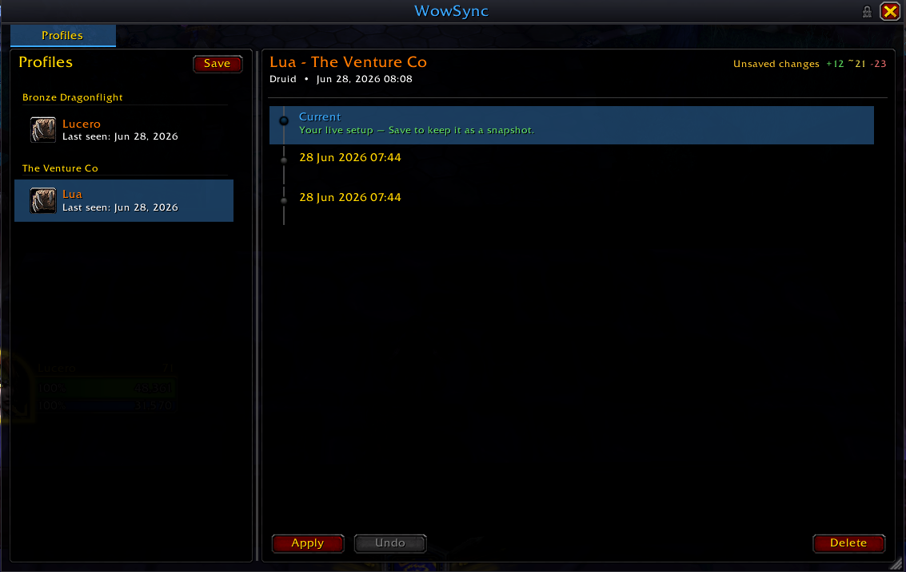
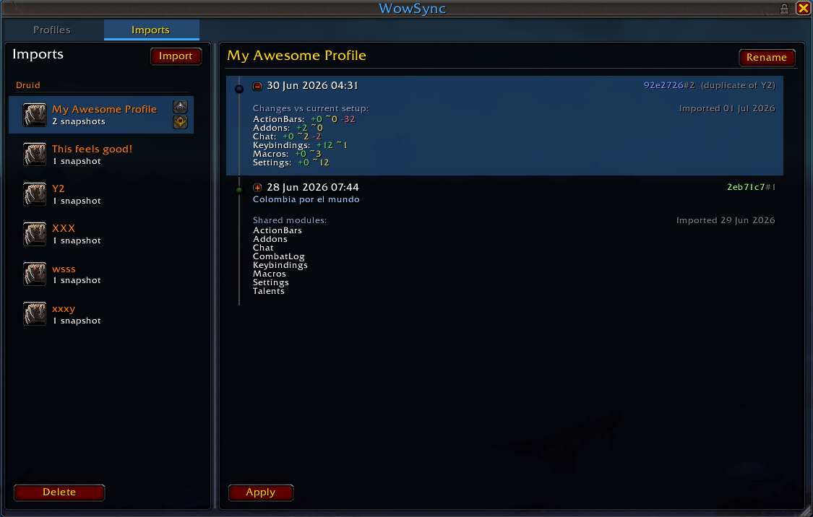

# WowSync

> ⚠️ Beta. WowSync is new and still settling in. Applying a profile replaces the selected parts of your setup — action bars, talents, macros, key bindings, and more — but each apply creates an Undo point, so changes can be rolled back from WowSync’s Undo history.

> ⚠️ One caveat: Undo can restore talent loadouts that were removed, but it won’t delete new loadouts that an apply created. Those can be cleared manually in the talent UI.

WowSync lets you capture a character's setup as a **snapshot** and apply it to any other character with a single click. Set up one character exactly how you like it, save it, then bring action bars, talents, macros, key bindings and more to your alts in seconds. You can also **export** a snapshot as a portable string and **import** one someone else shared.

Each character has a **profile** — its own history of snapshots — and a **Current** entry that mirrors its live setup. A snapshot is what actually stores your captured setup; a profile is just the timeline of snapshots for that character.

To open the WowSync window, click the AddOn Compartment icon or type `/ws`.

## What Gets Synced

Every snapshot captures the following, and you choose which parts to apply per character:

* **Action Bars** — your action bar layout. When applying across classes, only shared (non class-specific) actions are copied.
* **Talents** — talent loadouts for the matching specialization.
* **PvP Talents** — your PvP talent selection.
* **Macros** — account-wide and character-specific macros.
* **Key Bindings** — your key binding setup.
* **Chat** — chat windows and tabs.
* **Combat Log** — combat log filters.
* **Settings** — interface and console (CVar) settings.
* **Addons** — which addons are enabled.

## The WowSync Window (WowSync_UI)

The window is the heart of WowSync, and it is where the addon really shines. It is a dedicated, point-and-click interface for managing every character and snapshot visually — no commands to memorise, nothing to type. Browse your characters in a list, scroll through each one's snapshot history, and read the note attached to every save. Before you apply anything, a **preview** shows you exactly what will change, module by module, so there are no surprises. You pick which parts to bring over and, for each one, whether to **Merge** or replace with an **Exact** copy — all from a few clicks.

This rich interface lives in a separate companion addon, **WowSync_UI**, which ships alongside WowSync. The core addon loads it on demand the moment you open the window, so there is nothing extra to set up — just keep both addons in your `AddOns` folder and click the AddOn Compartment icon.

The [slash commands](#slash-commands) are a convenient shortcut for quick, repetitive actions and for scripting in macros, but they are not the main event — the window is. If WowSync_UI is missing or disabled, the core still works on its own through the commands, so you are never locked out; you simply lose the visual experience that makes WowSync worth using.

## Using the Window

Open or close the window in either of two ways:

* Click the **WowSync icon in the AddOn Compartment** (the menu at the top of the minimap).
* Type `/ws` or `/wowsync`.

Once it is open:

* **Characters** — the left panel lists your characters, each showing its class and when it was **last seen**. Select one to see its timeline on the right.
* **Current** — at the top of every character's timeline is a **Current** entry: a live view of that character's setup right now (for the character you are logged in on) or as of its last logout (for an alt). It is always shown, so what you are looking at is never a mystery.
* **Save** — saving captures the selected character's current setup as a new **snapshot** below Current. Use the save dialog to add a short note and to choose which parts of your setup to include. A save always creates a snapshot, even when nothing has changed since the last one.
* **Snapshot timeline** — each character keeps a history of snapshots beneath Current, newest first. **Pinned** snapshots float to the top of the history (just below Current) and are marked in orange; they are never pruned automatically. Select a snapshot to see its note and what changed compared to your current setup.
* **Apply** — apply Current or any snapshot to the character you are logged in on. You can choose which modules to apply and, per module, whether to **Merge** (add to what you already have) or use **Exact** (replace it to match the snapshot).
* **Pin / Edit note / Delete** — right-click a snapshot to pin or unpin it, edit its note, or delete it. Deleting a character's profile removes its whole history.

## Sharing: Export & Import

Snapshots are not stuck on your account. **Export** turns Current or any snapshot into a portable text string you can send to anyone; **Import** turns a pasted string back into a snapshot ready to apply. Shared strings are anonymised — only the class, capture time, and note travel with the setup, never your character or realm name.

Imports live in their own list, separate from your characters, and are locked to the class they were captured on, so you cannot apply a Warrior's bars onto a Mage. Each import is a named **container** that keeps its own timeline of imported snapshots, so you can gather several versions of a setup in one place. Right-click a container to **Rename** it, **Add snapshot** (paste another string into it), or **Delete** it.

The import list is grouped by class, with your logged-in character's class shown first so the setups you can actually use sit right at the top. When a class holds more than one container, hover or select a row to reveal up/down arrows on its right edge; use them to reorder the containers within that class, and the order is remembered between sessions.

A container's snapshots read newest first, just like a character's timeline, and can be **pinned** — right-click a snapshot to pin or unpin it. Pinned snapshots float to the top of the timeline and are marked in orange. Apply an import exactly like any snapshot, picking modules and Merge or Exact per module.

## Moving, Resizing & Locking

The window remembers its position, size, and panel layout between sessions.

* **Move** — drag the title bar to reposition the window.
* **Resize** — drag the grip in the bottom-right corner.
* **Reset** — double-click the resize grip to restore the default size and re-centre the window.
* **Lock** — click the padlock in the title bar to lock the window. While locked it cannot be moved or resized, the panel splitter cannot be dragged, and the resize grip is hidden. Click the padlock again to unlock. Your choice is remembered across reloads.

## Live Tracking

WowSync keeps an eye on your game state (setup) as you play. When you move an action button, edit a macro, change a key binding, or tweak any other tracked part of your setup, WowSync notices and keeps its picture of your current setup up to date on its own — so the **Current** entry, a preview, or a save always reflects exactly what you have right now, including how many entries were added, changed, or removed compared with a snapshot.

Anything that could interfere during combat (such as action bars) waits until you leave combat and then catches up automatically. Live tracking runs **on demand** — only while something needs your live setup, such as when the WowSync window is open — so it costs nothing while you just play. You can turn it off entirely, or back to on-demand, at any time with `/ws watcher off|lazy`.

## Slash Commands

`/ws` and `/wowsync` are interchangeable — every command below works with either prefix.

| Command | Description |
|---|---|
| `/ws` | Open or close the WowSync UI window. |
| `/ws status [addon\|profile\|watcher\|debug]` | Show what WowSync is currently doing. |
| `/ws watcher off\|lazy` | Track your setup live on demand, or turn tracking off entirely (lazy by default). |
| `/ws button hide\|show` | Show or hide the WowSync minimap button. |
| `/ws reset database\|db` | Delete all saved profiles, snapshots, and imports, while keeping your settings. |
| `/ws debug on\|off` | Record detailed debug data to WowSyncDebugDB (off clears it). |
| `/ws help` | Show the command list. |

`/ws debug` is a diagnostic aid for bug reports, not part of everyday use. **What** it does: while on, WowSync records detailed internal events (commands, saves, and UI actions) to its `WowSyncDebugDB` saved-variables file. **Why** you'd use it: if something misbehaves, turning it on captures exactly what the addon did so the log can be shared when reporting an issue. **How** to use it: run `/ws debug on`, reproduce the problem, then reload or log out so the events are written to `WowSyncDebugDB.lua` in your account's `SavedVariables` folder — that file is what you attach to a bug report. Use `/ws status debug` to confirm recording is on and how many events have been captured. Logging persists across sessions until you run `/ws debug off`, which stops recording and clears the log.

## Undo

Applying a snapshot is reversible. After an apply, use **Undo** in the window to restore your previous setup. The window keeps a history of recent changes, so you can step back through several applies in one go — pick an entry in the **Recent changes** list to undo everything back to that point.

Talent loadouts are an exception: undo can restore loadouts that were removed, but it will not delete talent loadouts that an apply added. Any extra loadouts can be removed manually in the talent UI.

## Developers

WowSync validates its own internal calls with the [Contracts](https://github.com/Eyal-WowHub/Contracts) library. Unpackaged (source) builds are flagged with `## X-WowSync-DevMode: 1` in the TOC — which the packager strips from every release — and run every contract check, printing a developer-mode notice at login. Packaged releases skip the expensive checks, and there is nothing to configure.

## Side Notes

* Profiles and snapshots are saved per account, so they are shared across all of your characters.
* When applying a snapshot from a different class, class-specific content (such as talents) is skipped — only what is compatible is applied.
* Feedback is always welcome.
